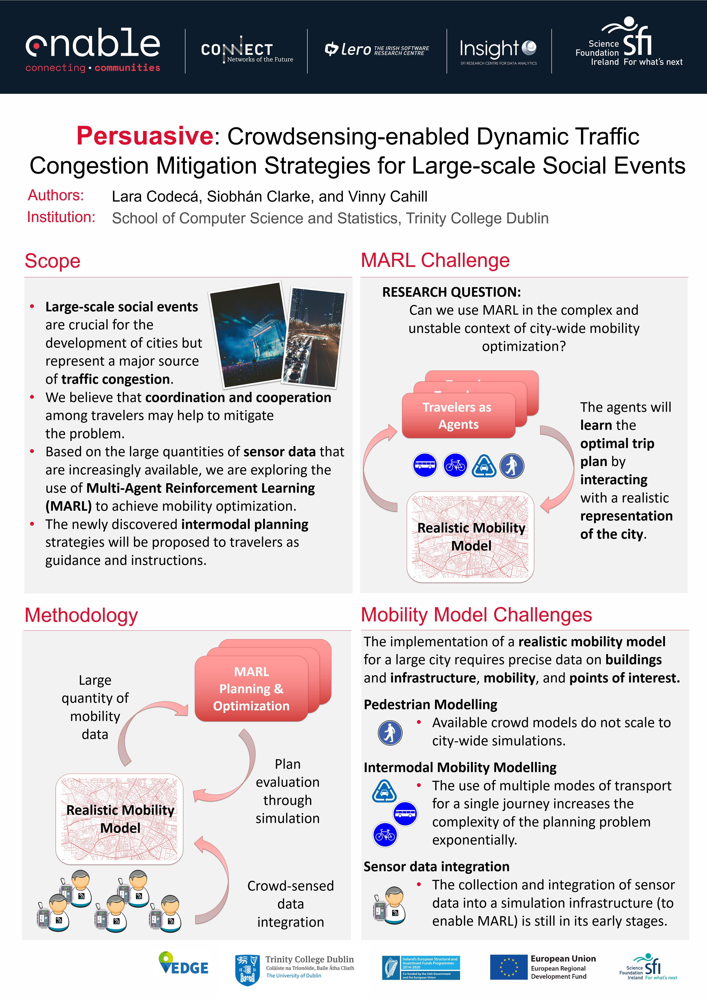
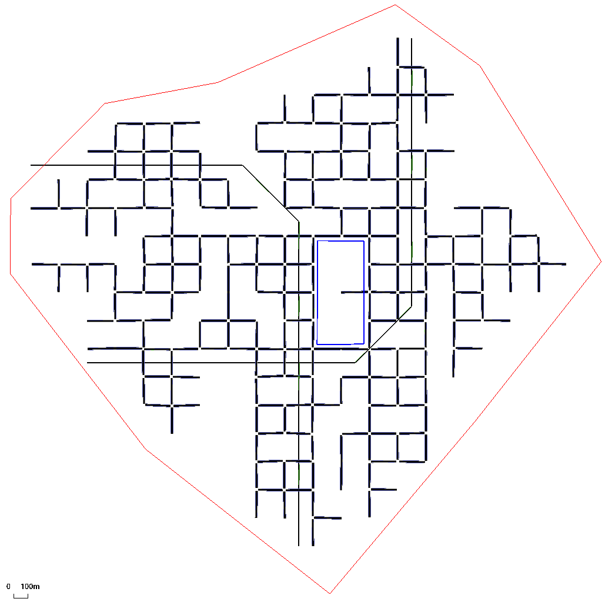
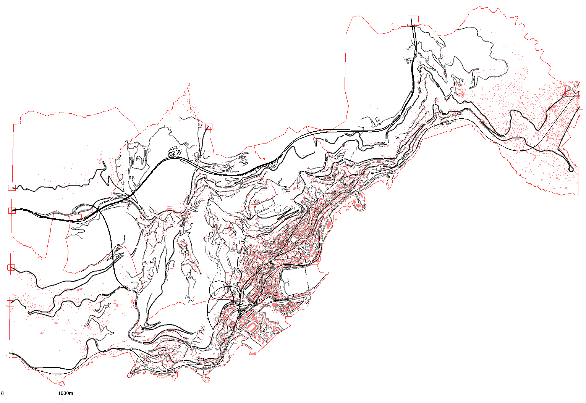

# “Persuasive” in a nutshell

# Scope
Urban traffic congestion is a significant problem that has repercussions for economic growth and the wellness of urban populations. Large-scale social events (e.g., sports events, concerts, or demonstrations) represent an integral aspect of living in a city but are frequently a source of severe traffic disruption, with an impact on both the people participating in the event and the wider community.  

With urban transportation infrastructures fast reaching their capacities, the only viable strategy to alleviate congestion is to optimise the use of the available resources. *We hypothesise that better coordination and cooperation between travellers could help to reduce congestion, for example, by balancing the load among the different modes of transport and reducing the time required to find parking spaces*. Motivated by the availability of fine-grained sensor data from individuals and vehicles and the opportunity to influence traveller behaviour in real-time through appropriate feedback, the objective of this work is to implement dynamic multi-modal traffic congestion mitigation strategies for large-scale social events, improving travel and parking delays through load balancing of the transportation modes and staggered departure times.  

Our approach is to use machine learning techniques to identify travel optimisation strategies that also leverage IoT infrastructures for participatory sensing and data dissemination. *Through reinforcement learning, we expect to recognise underlying patterns in the mobility surrounding events that can be exploited to optimise journey planning.* 

Our proposed solution comprises of planning strategies that can be proposed to travellers as guidance and instructions. Considering the constraints arising from large-scale social events, *we aim to present dynamic strategies for congestion mitigation based on participatory sensing and feedback-loop information that optimise the use of multi-modal transportation capacity*.  

In the scope of this research project, the only information that may be required from individuals is anonymised location. Throughout the design and implementation process, anonymisation strategies will be used to guarantee that no identifiable personal data will be collected or processed by the system. 

**_This project has received funding from the European Union’s Horizon 2020 research and innovation programme under the Marie Skłodowska-Curie grant agreement No. 713567. ENABLE is funded under Science Foundation Ireland (16/SP/3804) and is co-funded under the European Regional Development Fund._**

#### Contacts
- Dr. Lara CODECA <[lara.codeca@tcd.ie](mailto:lara.codeca@tcd.ie)>
- Prof. Vinny CAHILL <[vinny.cahill@tcd.ie](mailto:vinny.cahill@tcd.ie)>

# The IDEA

The plan is to develop a smartphone application to provide the planning information to eventgoers and to collect data on the current traffic situation. 

The realistic mobility model is built based on open data and refined with the crowd-sourced information.  

The planning and optimisation are done using MARL algorithms, with agents exploring the environment while interacting with the mobility simulation. 

The trip plan is directly tested in the simulation environment, and the feedback loop is provided to the optimisation. 

# Challenges

## Multi-Agent Deep Reinforcement Learning 

RESEARCH QUESTIONS:  
* Can we use (deep) MARL in the complex and unstable context of city-wide mobility optimisation?  
* Can agents representing travellers learn optimal trip plans by interacting with a realistic representation of the city? 

## Mobility Model 

The quality of the solution provided by Persuasive depends on the realism of the simulation.
The implementation of a realistic mobility model for a large city requires precise data on buildings and infrastructure, mobility, and points of interest.   
* Pedestrian Modelling: Available crowd models do not scale to city-wide simulations.  
* Intermodal Mobility Modelling: The use of multiple modes of transport for a single journey increases the complexity of the planning problem exponentially.  
* Sensor data integration: The collection and integration of sensor data into a simulation infrastructure (to enable MARL) is still in its early stages. 

# Infrastructure 

## Ray – RLlib 

[Ray](https://docs.ray.io/en/master/ray-overview/index.html) provides a simple, universal API for building distributed applications. 

[RLlib](https://docs.ray.io/en/master/rllib.html) is an open-source library for reinforcement learning built on top of Ray. It offers both high scalability and a unified API for a variety of applications. RLlib natively supports TensorFlow, TensorFlow Eager, and PyTorch, but most of its internals are framework agnostic. 

### Algorithms 

RLlib provides a suite of [algorithms](https://docs.ray.io/en/master/rllib-algorithms.html) already implemented that we are using to study the Persuasive learning problem. 
In our preliminary work, we used [A3C](https://docs.ray.io/en/master/rllib-algorithms.html#a3c) with and without LSTM, [DQN](https://docs.ray.io/en/master/rllib-algorithms.html#dqn) and [PPO](https://docs.ray.io/en/master/rllib-algorithms.html#ppo). 

## SUMO Mobility Simulator  
"Simulation of Urban MObility" [(SUMO)](https://sumo.dlr.de/docs/index.html) is an open-source, highly portable, microscopic and continuous traffic simulation package designed to handle large networks. It allows for intermodal simulation including pedestrians and comes with a large set of tools for scenario creation. 

### Scenarios 

During implementation and testing we are using an extension of the random grid scenario available through the [PyPML](https://github.com/lcodeca/PyPML/tree/master/examples/random_grid) library and for the final evaluation and validation, we are going to use the [MoST Scenario](https://github.com/lcodeca/MoSTScenario) a general-purpose realistic multi-modal mobility model of the Principality of Monaco. 

Random Grid                          |  MoST Scenario
:-----------------------------------:|:----------------------------------------------------:
  |  

## RLlib SUMO Utils 
In order to connect the SUMO simulator with the RLlib distributed environment, we implemented a [python library](https://github.com/lcodeca/rllibsumoutils) and a [Docker environment](https://github.com/lcodeca/rllibsumodocker) for testing.  

**Note: the library has been included in [RLlib master](https://github.com/ray-project/ray/pull/11710) and is going to be available in future official releases.**

# Learning environment  
The learning environment we implemented is based on [OpenAI Gym compatible MARL Environment](https://github.com/ray-project/ray/blob/master/rllib/env/multi_agent_env.py), and it provides the interaction between the learning and SUMO. 

## Agents 
Our agents represent the eventgoers. Their goal is to learn how to reach the event on time, using the optimal transportation mode in the context of other eventgoers' plans and the background (non-event-related) mobility demand. In practice, the travel plan needs to minimise the time spent waiting at the destination, without being late, and this is reflected in the reward. 

## Actions  
The agents available to agents include "wait" (i.e., delay the start of the journey) and actions designed to initiate a journey now depending on available models of travel (e.g., "walk", "public transport", "bicycle", "car", "motorbike").  

## States 
The state space features include the origin and destination, the time to the event, and the estimated travel time for each mode of transport. Additionally, based on the idea that the agents are using an application on their smartphone to receive the trip plan, the future demand (agents that are still waiting) and the current transportation mode usage (based on the other agents' actions) is added to the features and used to model implicit cooperation among the agents. 
